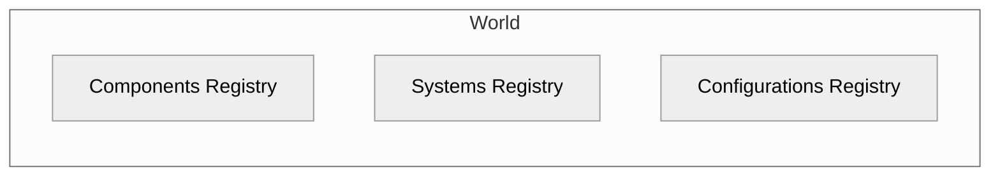
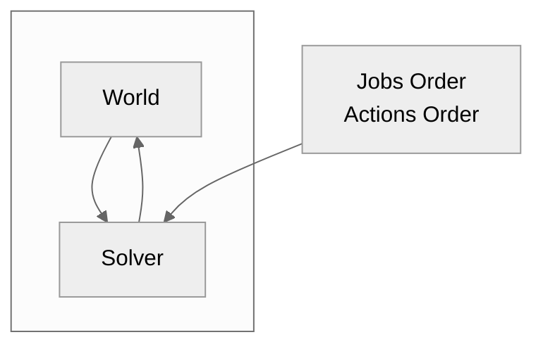
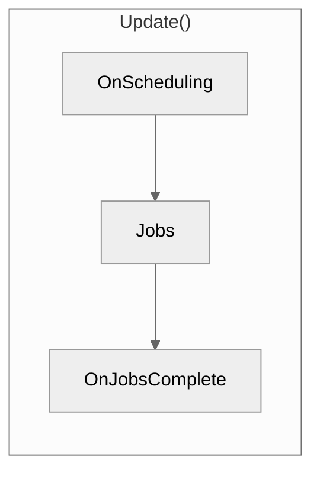
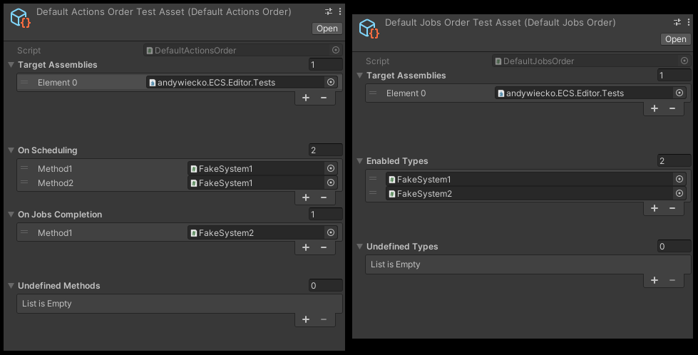
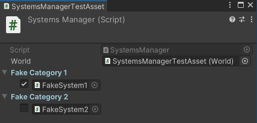
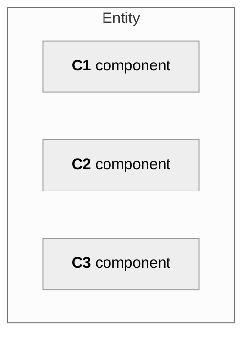
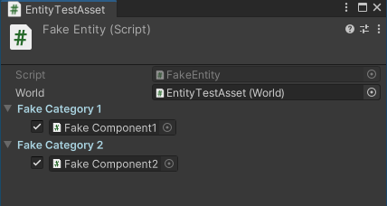
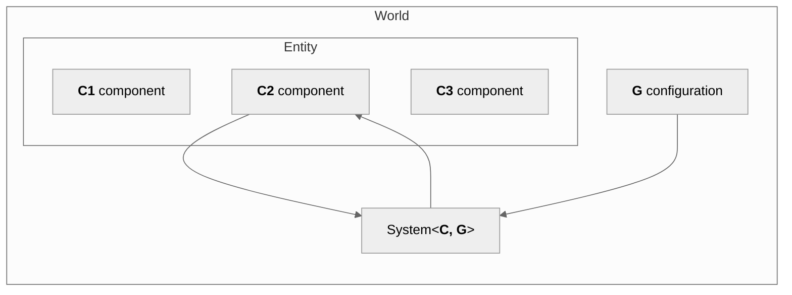
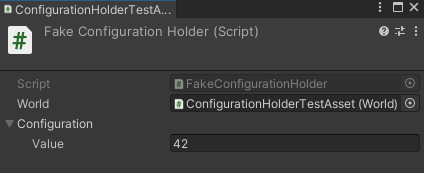

# ECS

Custom Entity Component System architecture designed to work with "large" entities.

> **Warning**
>
> The package is in a preview state.
> The API may change without advance notice.
> Production usage is not recommended.

[](https://github.com/andywiecko/ECS/actions/workflows/build.yml) [](https://github.com/andywiecko/ECS/actions/workflows/test.yml) [](https://codecov.io/gh/andywiecko/ECS) [](https://openupm.com/packages/com.andywiecko.ecs/)

**Package summary:**

- Skeleton of the ECS architecture model designed especially for large entities (e.g. entities which contain thousand of triangles etc).
- Package forces to keep your logic and data separate and maintain the ECS design pattern.
- `Unity.Burst` friendly systems.
- Easily customizable engine.
- Easily testable architecture.
- Auto-creation of component tuples for selected types.
- Basic implementations of the `World`, `Solver`, `Entity`, `BaseComponent`, `BaseSystem<T>`, `SolverJobsOrder`, `SolverActionsOrder`, and more.
- *static*less features, all objects used in the engine are not static (except utils/extensions).

## Table of Contents

- [ECS](#ecs)
  - [Table of Contents](#table-of-contents)
  - [Getting started](#getting-started)
  - [Introduction](#introduction)
  - [World](#world)
  - [Solver](#solver)
  - [Systems Manager](#systems-manager)
  - [Entities](#entities)
  - [Components](#components)
  - [Systems](#systems)
  - [Configurations](#configurations)
  - [Components tuples](#components-tuples)
  - [Roadmap v1.0.0](#roadmap-v100)
  - [Dependencies](#dependencies)

## Getting started

Install the package using one of the following methods

<details open>
<summary> Using scoped registry <b>(recommended)</b> </summary>
Use OpenUPM CLI or add corresponding entries to the project's <code>manifest.json</code> manually.
Add or modify scoped registries in the manifest
<pre>
  "scopedRegistries": [
    {
      "name": "OpenUPM",
      "url": "https://package.openupm.com/",
      "scopes": [
        "com.andywiecko"
      ]
    }
  ]
</pre>
and in the dependencies provide selected version of the package
<pre>
"dependencies": {
    "com.andywiecko.ecs": "0.2.1",
    ...
</pre>
See Unity docs for more details https://docs.unity3d.com/2021.1/Documentation/Manual/upm-scoped.html
</details>

<details>
<summary> <code>git</code> install </summary>
Use package manager via git install: https://github.com/andywiecko/ECS.git#v0.2.1
</details>

<details>
<summary> Manual instalation </summary>
Clone or download this repository and then select <code>package.json</code> using Package Manager (<code>Window/Package Manager</code>).
</details>

## Introduction

The package implements a custom approach to the [ECS design pattern](https://en.wikipedia.org/wiki/Entity_component_system).
ECS stands for ***e****ntity* ***c****omponent* ***s****ystem*.
In principle, the pattern is relatively simple.
Entities contain components, components include data, and systems modify the data in the components.
The key feature of the pattern is that logic and data are separated, i.e. all data can be found in components, and logic in systems.

This package was built as a core feature of the [**PBD2D**][pbd2d] engine.
It is designed to work with large entities, i.e. entities that hold a large amount of data.
For small entities up to a few bytes, I could recommend using the [`Unity.Entities`](https://docs.unity3d.com/Packages/com.unity.entities@0.50/manual/index.html).

## World

The main part of the framework is the `World`.
`World` can be considered as database, a container for all data injected into the simulation.
It contains information about registered components, set configurations, and enabled systems.



## Solver

At `Solver` one can configure the execution order of the systems by passing the proper `ScriptableObject` with configuration, namely `JobsOrder` and `ActionsOrder`.



`Solver` contains `OnScheduling` event, list of jobs[^jobs], and `OnJobsComplete` event, which are invoked every `Solver.Update()` in order, respectively



One can introduce a custom hierarchy of the solver lifecycle by implementing `ActionsOrder` and `JobsOrder`.
The package contains default basic implementations:

- `DefaultActionsOrder` supports solver action on scheduling/on jobs complete events selection.
- `DefaultJobsOrder` supports linear ordering of the jobs.

Below there is a figure of `DefaultActionOrder` and `DefaultJobsOrder` editors.
The selected assets are directly fetched from test assembly.



> **Note**
>
> More complex `JobsOrder` implementation can be found at [PBD2D][pbd2d].

## Systems Manager

The `SystemManager` is responsible for populating the `World.SystemRegistry` with all target system instances.
Default active status of a given system type can be set there, as well as, given system status can be changed during runtime.

In the figure below one can find the `SystemsManager` editor.
The selected asset is directly fetched from the test assembly.



## Entities

Entities are just `MonoBehaviour`s to which one attaches the components.
To derive a new entity implement the abstract `Entity` class.

```csharp
public class MyEntity : Entity
{

}
```



In the figure below one can see the `Entity` editor.
The selected asset is directly fetched from the test assembly.



> **Note**
>
> `[RequireComponent(typeof(MyEntity))]` attribute can be used to mark the given component to be visible at a given `Entity` editor.

## Components

The components shouldn't contain any logic by design.
Components should be treated as pure objects for holding the data and/or configuration.
The given components can be attached to selected entity types only.

To create new a component it is crucial to add a new component contract.
Introducing the contract is essential since system does not know any information about component implementations and it is required that system works on selected interface.

```csharp
public interface IMyComponent : IComponent
{

}
```

Then one has to implement the introduced interface.
The `BaseComponent` class can be helpful, however, it is not necessary to use the class and the contract can be implemented on the *pure C#* (non-`MonoBehaviour`) class.

```csharp
[RequiredComponent(typeof(MyEntity))]
public class MyComponent : BaseComponent, IMyComponent
{

}
```

## Systems

All logic related to components data should be included in systems.
It is recommended to implement the abstract class `BaseSystem<T>` or `BaseSystemWithConfiguration<T, V>`, however,
one can implement a custom system by implementing the general `BaseSystem` class.

When one does not require some configuration, use `BaseSystem<T>` where `T` corresponds to the interface assigned from `IComponent`.
In the following snippet, the system schedules selected jobs on all  `IMyComponent`s objects from the `World` for which the system is attached to

```csharp
public class MySystem : BaseSystem<IMyComponent>
{
    public override JobHandle Schedule(JobHandle dependencies)
    {
        foreach(var component in References)
        {
            // ...
        }

        return dependencies
    }
}
```

Sometimes one needs to provide some global configurations to the system (e.g. gravity).
More information related to configurations can be found at [#Configurations](#configurations).
Assuming that `SimulationConfiguration` is defined,
the system can implement `BaseSystemWithConfiguration`

```csharp
public class MySystemWithConfiguration : BaseSystemWithConfiguration<IMyComponent, SimulationConfiguration>
{
    public override JobHandle Schedule(JobHandle dependencies)
    {
        foreach(var component in References)
        {
            var c = Configuration;
            // ...
        }

        return dependencies
    }
}
```

> **Note**
>
> Using `BaseSystemWithConfiguration` class is not required for accessing the configurations.
> One can find them through `World.ConfigurationsRegistry`.



Except for jobs, one can define actions inside systems as well, just by decorating the system's method with the `SolverAction` attribute

```csharp
public class MySystem : BaseSystem
{
    [SolverAction]
    private void MyMethod()
    {

    } 

    // ...
}
```

## Configurations

Configurations are similar to components, but with the restriction that only one instance of the given type of configuration can be present at `World.ConfigurationsRegistry`.
Configurations can be used for setting the global values related to the `World`, e.g. global gravity vector.
The configuration must implement the `IConfiguration` interface, for example

```csharp
[Serializable]
public class MyConfiguration : IConfiguration
{
    [field: SerializeField]
    public int Value { get; private set; } = 0;
}
```

Additionally, to instantiate configuration at the scene, implement the corresponding holder

```csharp
public class MyConfigurationHolder : ConfigurationHolder<MyConfiguration> { }
```

Below one can find an example `ConfigurationHolder` editor.



## Components tuples

Components can be matched into pairs by using tuples.
A component tuple is a virtual component that can be created automatically and does not live on the scene.
It is useful in cases when one needs to introduce some kind of interaction e.g. collisions.

```csharp
public IMyTuple : IComponent
{

}
```

```csharp
public MyTuple : ComponentsTuple<IMyComponent, IMyComponent>, IMyTuple
{
     protected override bool InstantiateWhen(IMyComponent c1, IMyComponent c2) => c1.Id != c2.Id;
}
```

Currently, the package supports only two argument tuples.

## Roadmap v1.0.0

- [ ] `EntitiesRegistry`
- [ ] Actions only system impl.
- [ ] Scheduling jobs from job.
- [ ] Jobs caching mechanism.
- [ ] Components/entities initialization dependencies.

## Dependencies

- [`Unity.Collections`](https://docs.unity3d.com/Packages/com.unity.collections@1.2/manual/index.html)
- [`andywiecko.BurstCollections`](https://github.com/andywiecko/BurstCollections)
- [`Unity.Nuget.Newtonsoft-Json`](https://docs.unity3d.com/Packages/com.unity.nuget.newtonsoft-json@2.0/manual/index.html)

[pbd2d]:https://github.com/andywiecko/PBD2D

[^jobs]:More precisely list of type `List<Func<JobHandle, JobHandle>>`.
