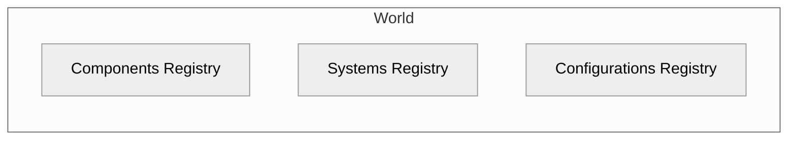
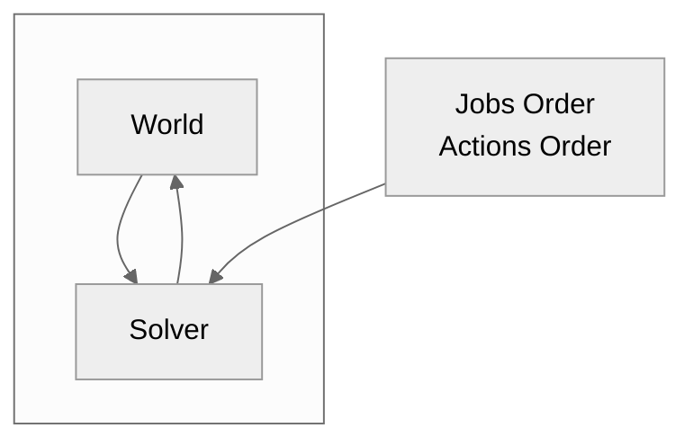
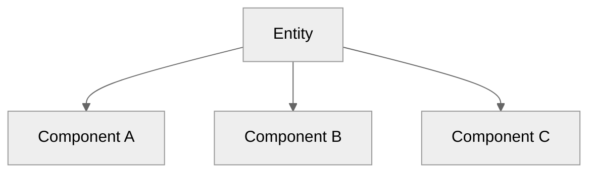

# ECS

Custom Entity Component System architecture designed to work with "large" entities.

## Package summary

- Skeleton of the ECS architecture model designed especially for large entities (e.g. entities which contains thousand of triangles etc). 
- Package forces to keep your logic and data separate and maintain the ECS design pattern.
- `Unity.Burst` friendly systems.
- Easily customizable engine. 
- Easily testable architecture.
- Auto-creation of components tuples for selected types.
- Basic implementations of the `World`, `Solver`, `Entity`, `BaseComponent`, `BaseSystem<T>`, `SolverJobsOrder`, `SolverActionsOrder`, and more. 
- *static*less features, all objects used in the engine are not static (except utils/extensions).

**TODO:** table of contents here?

## Introduction

The package implements custom approach to the [ECS design pattern](https://en.wikipedia.org/wiki/Entity_component_system).
ECS stands for **_e_**_ntity_ **_c_**_omponent_ **_s_**_ystem_.
In principle the pattern is rather simple.
Entities contain components, components contain data, and systems modify the data in the components.
The key feature of the pattern is that logic and data are separated, i.e. all data can be found at components, and logics at systems.

This package was build as a core feature of the [PBD2D][pbd2d] engine. **TODO:** ADD FOOTNOTE HERE
It is designed to work with large entities, i.e. entities which holds large amount of data.
For small entities up to a few bytes, I could recommend using the `Unity.Entities`.

## World

The main part of the framework is the `World`.
`World` can be considered as data base, a container for all data injected into the simulation.
It contains information about registered components, set configurations, and enabled systems. 




## Solver

At `Solver` one can configure execution order of the systems by passing the proper `ScriptableObject` with configuration, namely `SolverJobsOrder` and `SolverActionsOrder`.
There are available default implementations of those, however, 
one can find more complex example at [PBD2D][pbd2d]



- `Entity`: `MonoBehaviour` for which one attaches components.
- `BaseComponent`: component where the data related to `Entity` live.
- `BaseSystem<T>`: grabs all the objects of type `T` from the `World` and perform selected operation with this. 
- `IConfiguration`: implement the interface and add "global" configuration of your `World`.
- `ComponentsTuple<T1, T2>`, i.e. component which is automagicaly created/destroyed if certain components of type `T1`, `T2` are added to the `World`


## Entities

Entities are just `MonoBehaviour`s to which one attaches the components.
To derive new entity implement abstract `Entity` class.

```csharp
public class MyEntity : Entity
{

}
```



## Components

The components shouldn't contain any logic by design.
Components should be treated as pure objects for holding the data and/or configuration.
The given components can be attached to selected entity types only.

To create new a component it is crucial to add a new component contract.
Introducing the contract is essential since system does not know any information about component implementations and it is required that system works on selected interface.

```csharp
public interface IMyComponent : IComponent
{

}
```

Then one has to implement the introduced interface.
`BaseComponent` class can be helpful, however, it is not necessary to use the class and the contract can be implemented on _pure C#_ (non-MonoBehaviour) class.

```csharp
[RequiredComponent(typeof(MyEntity))]
public class MyComponent : BaseComponent, IMyComponent
{

}
```

## Systems

## Configurations

## Components tuples

Components can be matched into pairs by using tuples.
A component tuple is a virtual component that can be created automatically and does not live on the scene. 
It is useful in the cases when one needs to introduce some kind of interaction e.g. collisions.

```csharp
public IMyTuple : IComponent
{

}
```

```csharp
public MyTuple : ComponentsTuple<IMyComponent, IMyComponent>, IMyTuple
{
     protected override bool InstantiateWhen(IMyComponent c1, IMyComponent c2) => c1.Id != c2.Id;
}
```

Currently, the package supports only two argument tuples.

## Roadmap

### v1.0.0

- [ ] Defaults impl of the scriptable objects.
- [ ] Editors utilities and editors for base components.

### v2.0.0

- [ ] Scheduling jobs from job.

## Dependencies

[pbd2d]:https://github.com/andywiecko/PBD2D
