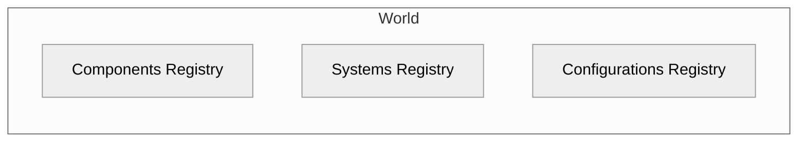
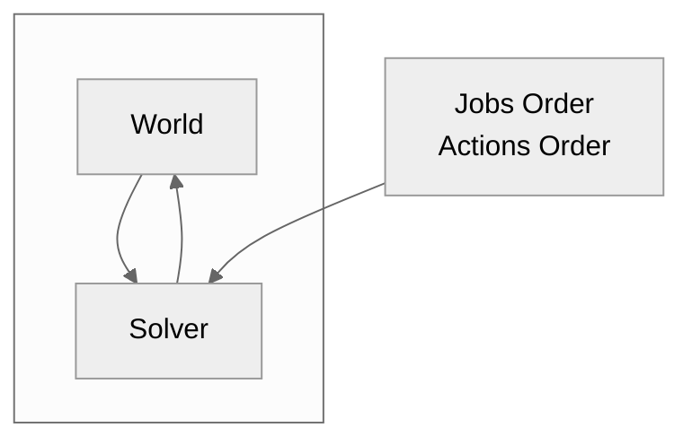
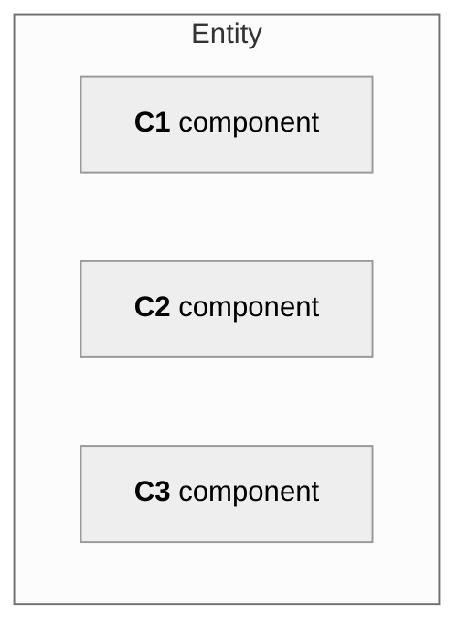
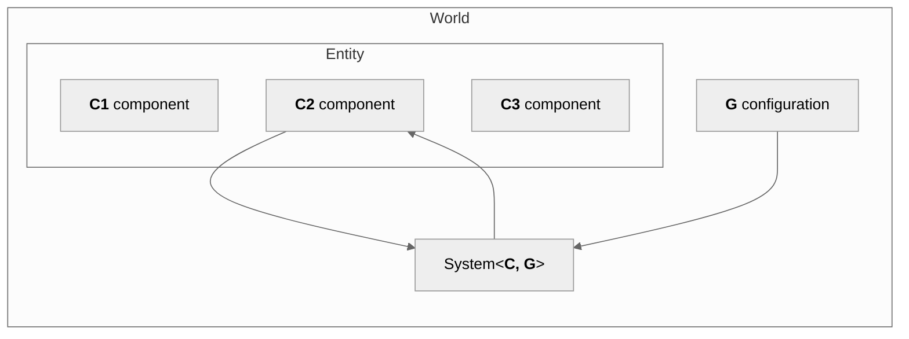

# ECS

Custom Entity Component System architecture designed to work with "large" entities.

> **Warning**
>
> Package is in PREVIEW.
> The API may change without advance notice.
> Production usage is not recommended.

**Package summary:**

- Skeleton of the ECS architecture model designed especially for large entities (e.g. entities which contain thousand of triangles etc). 
- Package forces to keep your logic and data separate and maintain the ECS design pattern.
- `Unity.Burst` friendly systems.
- Easily customizable engine. 
- Easily testable architecture.
- Auto-creation of components tuples for selected types.
- Basic implementations of the `World`, `Solver`, `Entity`, `BaseComponent`, `BaseSystem<T>`, `SolverJobsOrder`, `SolverActionsOrder`, and more. 
- *static*less features, all objects used in the engine are not static (except utils/extensions).

## Table of Contents

- [ECS](#ecs)
  - [Table of Contents](#table-of-contents)
  - [Introduction](#introduction)
  - [World](#world)
  - [Solver](#solver)
  - [Entities](#entities)
  - [Components](#components)
  - [Systems](#systems)
  - [Configurations](#configurations)
  - [Components tuples](#components-tuples)
  - [Roadmap](#roadmap)
    - [v1.0.0](#v100)
  - [Dependencies](#dependencies)

## Introduction

The package implements a custom approach to the [ECS design pattern](https://en.wikipedia.org/wiki/Entity_component_system).
ECS stands for **_e_**_ntity_ **_c_**_omponent_ **_s_**_ystem_.
In principle, the pattern is rather simple.
Entities contain components, components contain data, and systems modify the data in the components.
The key feature of the pattern is that logic and data are separated, i.e. all data can be found in components, and logic in systems.

This package was built as a core feature of the [PBD2D][pbd2d] engine.
It is designed to work with large entities, i.e. entities that hold a large amount of data.
For small entities up to a few bytes, I could recommend using the [`Unity.Entities`](https://docs.unity3d.com/Packages/com.unity.entities@0.50/manual/index.html).

## World

The main part of the framework is the `World`.
`World` can be considered as database, a container for all data injected into the simulation.
It contains information about registered components, set configurations, and enabled systems. 



## Solver

At `Solver` one can configure the execution order of the systems by passing the proper `ScriptableObject` with configuration, namely `SolverJobsOrder` and `SolverActionsOrder`.
There are available default implementations of those, however, 
one can find more complex example at [PBD2D][pbd2d]



## Entities

Entities are just `MonoBehaviour`s to which one attaches the components.
To derive new entity implement the abstract `Entity` class.

```csharp
public class MyEntity : Entity
{

}
```



## Components

The components shouldn't contain any logic by design.
Components should be treated as pure objects for holding the data and/or configuration.
The given components can be attached to selected entity types only.

To create new a component it is crucial to add a new component contract.
Introducing the contract is essential since system does not know any information about component implementations and it is required that system works on selected interface.

```csharp
public interface IMyComponent : IComponent
{

}
```

Then one has to implement the introduced interface.
`BaseComponent` class can be helpful, however, it is not necessary to use the class and the contract can be implemented on _pure C#_ (non-MonoBehaviour) class.

```csharp
[RequiredComponent(typeof(MyEntity))]
public class MyComponent : BaseComponent, IMyComponent
{

}
```

## Systems

All logic related to components data should be included in systems.
It is recommended to implement the abstract class `BaseSystem<T>` or `BaseSystemWithConfiguration<T, V>, however,
one can implement a custom system by implementing the `ISystem` interface.

When one does not require some configuration, use `BaseSystem<T>` where `T` corresponds to the interface assigned from `IComponent`.
In the following snippet, the system schedules selected jobs on all  `IMyComponent`s objects from the `World` for which the system is attached to

```csharp
public class MySystem : BaseSystem<IMyComponent>
{
    public override JobHandle Schedule(JobHandle dependencies)
    {
        foreach(var component in References)
        {
            // ...
        }

        return dependencies
    }
}
```

Sometimes one needs to provide some global configurations to the system (e.g. gravity).
More information related to configurations can be found at [#configurations](#configurations).
Assuming that `SimulationConfiguration` is defined configuration,
the system can implement `BaseSystemWithConfiguration`

```csharp
public class MySystemWithConfiguration : BaseSystemWithConfiguration<IMyComponent, SimulationConfiguration>
{
    public override JobHandle Schedule(JobHandle dependencies)
    {
        foreach(var component in References)
        {
            var c = Configuration;
            // ...
        }

        return dependencies
    }
}
```

However, `BaseSystemWithConfiguration<T, V>` is not required to use configurations that are available in the `World`, it can be accessed from `BaseSystem<T>` too.
`BaseSystemWithConfiguration<T, V>` just helps the developers to easily see what is required by the given system.

```csharp
public class MySystemWithConfiguration : BaseSystem<IMyComponent>
{
    public override JobHandle Schedule(JobHandle dependencies)
    {
        foreach(var component in References)
        {
            var c = World.ConfigurationsRegistry.Get<SimulationConfiguration>();
            // ...
        }

        return dependencies
    }
}
```



**TODO** 
- solver action
- fake systems


## Configurations

## Components tuples

Components can be matched into pairs by using tuples.
A component tuple is a virtual component that can be created automatically and does not live on the scene. 
It is useful in the cases when one needs to introduce some kind of interaction e.g. collisions.

```csharp
public IMyTuple : IComponent
{

}
```

```csharp
public MyTuple : ComponentsTuple<IMyComponent, IMyComponent>, IMyTuple
{
     protected override bool InstantiateWhen(IMyComponent c1, IMyComponent c2) => c1.Id != c2.Id;
}
```

Currently, the package supports only two argument tuples.

## Roadmap

### v1.0.0

- [X] ~~A few tests...~~
- [ ] `EntitiesRegistry`
- [ ] Basic CI config (add sample project first)
  - [ ] Tests
  - [ ] Coverage
  - [ ] Build
- [ ] Scheduling jobs from job.
- [ ] Jobs caching mechanism.

## Dependencies

- [`Unity.Collections`](https://docs.unity3d.com/Packages/com.unity.collections@1.2/manual/index.html)
- [`andywiecko.BurstCollections`](https://github.com/andywiecko/BurstCollections)

[pbd2d]:https://github.com/andywiecko/PBD2D
